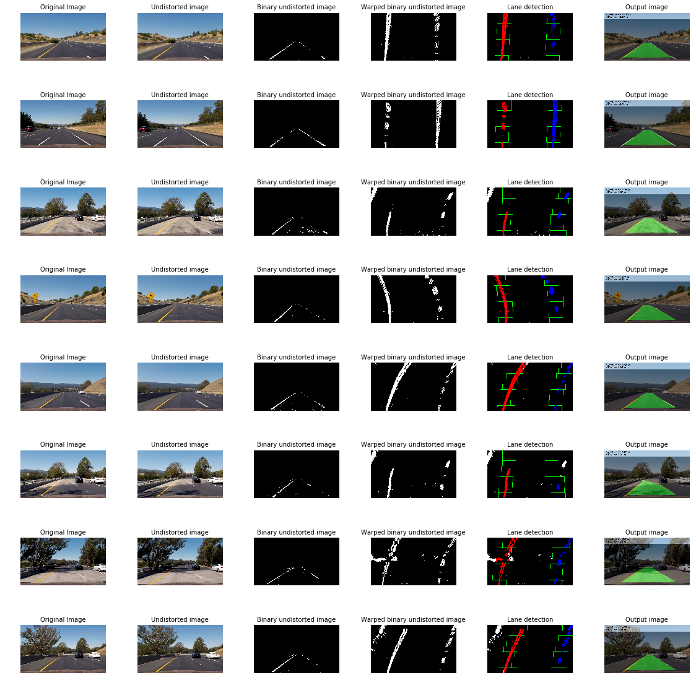

## Writeup 
---

**Advanced Lane Finding Project**

The goals / steps of this project are the following:

* Compute the camera calibration matrix and distortion coefficients given a set of chessboard images.
* Apply a distortion correction to raw images.
* Use color transforms, gradients, etc., to create a thresholded binary image.
* Apply a perspective transform to rectify binary image ("birds-eye view").
* Detect lane pixels and fit to find the lane boundary.
* Determine the curvature of the lane and vehicle position with respect to center.
* Warp the detected lane boundaries back onto the original image.
* Output visual display of the lane boundaries and numerical estimation of lane curvature and vehicle position.

## [Rubric](https://review.udacity.com/#!/rubrics/571/view) Points

### Here I will consider the rubric points individually and describe how I addressed each point in my implementation.  

---

### Writeup / README

#### 1. Provide a Writeup / README that includes all the rubric points and how you addressed each one.  You can submit your writeup as markdown or pdf.  [Here](https://github.com/udacity/CarND-Advanced-Lane-Lines/blob/master/writeup_template.md) is a template writeup for this project you can use as a guide and a starting point.  

You're reading it!
Also, I have two different notebook:
- one called training, where different solutions have been tested in order to understand which approach would suit this project best.
- The other one, advancedLaneLines, is focused on getting the project completed, with less disturbing images.

### Camera Calibration

#### 1. Briefly state how you computed the camera matrix and distortion coefficients. Provide an example of a distortion corrected calibration image.

The code for this step is contained in the second code cell of the IPython notebook located in `./training.ipynb` under this title:
**Camera calibration and distortion correction on the calibration images**

This step relies mainly on an available feature from openCV. This feature analyses a chess board like picture in order to detect the existing corners. 
I started by preparing "object points", which will be the (x, y, z) coordinates of the chessboard corners in the world. Here I am assuming the chessboard is fixed on the (x, y) plane at z=0, such that the object points are the same for each calibration image.  Thus, `objp` is just a replicated array of coordinates, and `objpoints` will be appended with a copy of it every time I successfully detect all chessboard corners in a test image, using `cv2.findChessboardCorners`. ` `imgpoints` will be appe`nded with the (x, y) pixel position of each of the corners in the image plane with each successful chessboard detection.  

I then used the output `objpoints` and `imgpoints` to compute the camera calibration and distortion coefficients using the `cv2.calibrateCamera()` function.  I applied this distortion correction to the test image using the `cv2.undistort()` function and obtained an undistorted image.

In order to get a more reliable transformation matrix, it is recommended to run this code over multiple chessboard images. Using all the available images I got this result: 

### Pipeline (test images)

#### 1. Provide an example of a distortion-corrected image.

Here we just need to re-use the same code as used on the calibration step.
The code can be found in `./training.ipynb` under this title:
**Distortion correction on the test images**
Here you can see the difference on the test set between the provided images and their undistorted transformation:

#### 2. Describe how (and identify where in your code) you used color transforms, gradients or other methods to create a thresholded binary image.  Provide an example of a binary image result.

Under the training notebook (`./training.ipynb`), several approaches can be found. My final choice, based on the test image set, uses the HLS color spaces and creates a combination of thresholded SobelX to detect vertical lines over the L channel, and  a threshold from the S channel. Then a mask is applied to remove details from outside the road. The code  can be found on the project notebook (`./advancedLaneLines.ipynb`) under this title:
**Define gradient function**
Bellow are several images with labels to provide an overview of what each binary processing code can achieve:

#### 3. Describe how (and identify where in your code) you performed a perspective transform and provide an example of a transformed image.

The code for my perspective transform includes a function called `warp()`, can be found in `./training.ipynb` under this title:
**Distortion correction on the test images**

The idea is quite simple, we just define the area around the lane, and tranform it to fill the full image area. The practical result is that it will look like a bird eye view, but with different scales for x and y.

I verified that my perspective transform was working as expected by drawing the `src` and `dst` points onto a test image and its warped counterpart to verify that the lines appear parallel in the warped image.

#### 4. Describe how (and identify where in your code) you identified lane-line pixels and fit their positions with a polynomial?

This part relies a lot on the quality of the gradient, to get rid of fakes. The code for this step can be found on notebook `./advancedLaneLines.ipynb` under this title:
**Define functions for lane lines detection**
Using an histogram, and detecting the arguments of their peak values, gives us and idea where the lines are.Then I defining a region around that first point, we just need to select the mean point (using numpy mean function) for each y value. Then using the array with the points coodinates, numpy function polyfit will return the parameters of the polinomial equation. With that equation we are now able to trace the identified line:

#### 5. Describe how (and identify where in your code) you calculated the radius of curvature of the lane and the position of the vehicle with respect to center.

This step is done on the same function as the previous step.
First I estimated the scale for my lane, 3,7 meters wide and 45 meters long, in order to provide real world values.
Then using it as a factor, I created a polyfit that would be scaled to the real world. Using the resulting equation, we can calculate the radius of the curvature using the function explained on this tutorial: https://www.intmath.com/applications-differentiation/8-radius-curvature.php

About the position of the car, the idea is knowing that the camera is centered, so we just need to identify the lines on the image and the diference between lines and their closest image edges (more acurately, half of it) will provide the distance to the center.

#### 6. Provide an example image of your result plotted back down onto the road such that the lane area is identified clearly.

Bellow is the pictur of the final result. On one of them we can clearly see a bad detection of the right line. I will discuss it after the video, where we can see that the pipeline recovers immediately after that.

---

### Pipeline (video)

#### 1. Provide a link to your final video output.  Your pipeline should perform reasonably well on the entire project video (wobbly lines are ok but no catastrophic failures that would cause the car to drive off the road!).

Here's a [link to my video result](output_images/output_project_video.mp4)

---

### Discussion

#### 1. Briefly discuss any problems / issues you faced in your implementation of this project.  Where will your pipeline likely fail?  What could you do to make it more robust?

I consider that my pipeline only has one minor and a small detection issue. None of them are relevent since they are very short in time, and the minor one, does not provide any valuable change to the center of the lane.
On both situations, it happens when there is a road surface change or when the car crosses shadows areas.
That same issue is visible on the challenge video with the sames trigers: surface changes and shadows. Although the detection is not good in this video, I believe that it's lack of accuracy wouldn't cause a crash of the autonomous vehicle.
[link to my challenge video result](output_images/output_challenge_video.mp4)
With the harder challenge video, the high occurence of shadows creates detections issues that most likely would create some possible crashes (or at least the first one, and then the car would stop :) ).
[link to my harder challenge video result](output_images/output_harder_challenge_video.mp4)
A valid solution for that issue would be to keep the information of the lines detection from the previous frame and create an area based on that where the probability of having the following lines would be very high.
